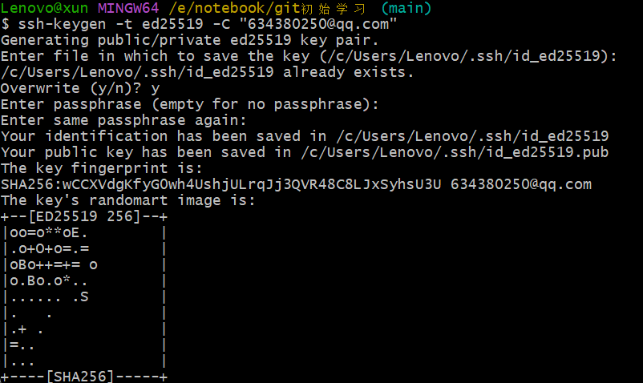
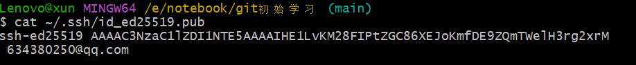
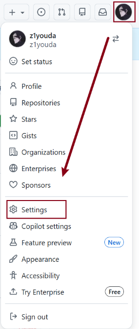
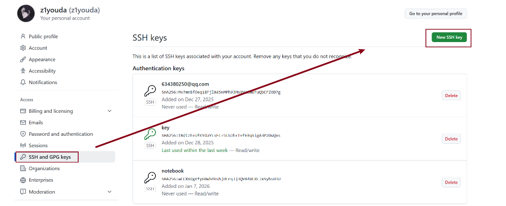
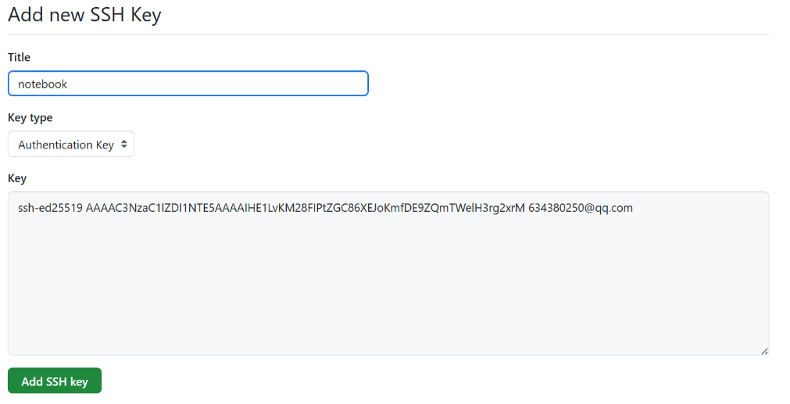
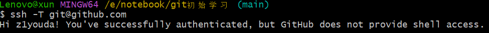
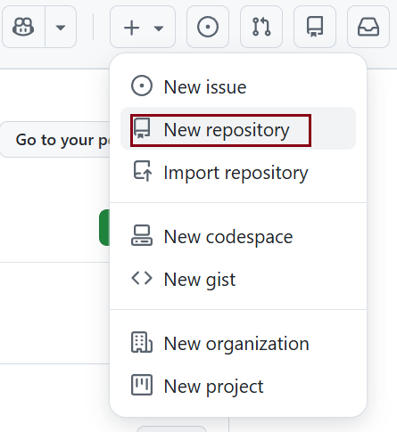
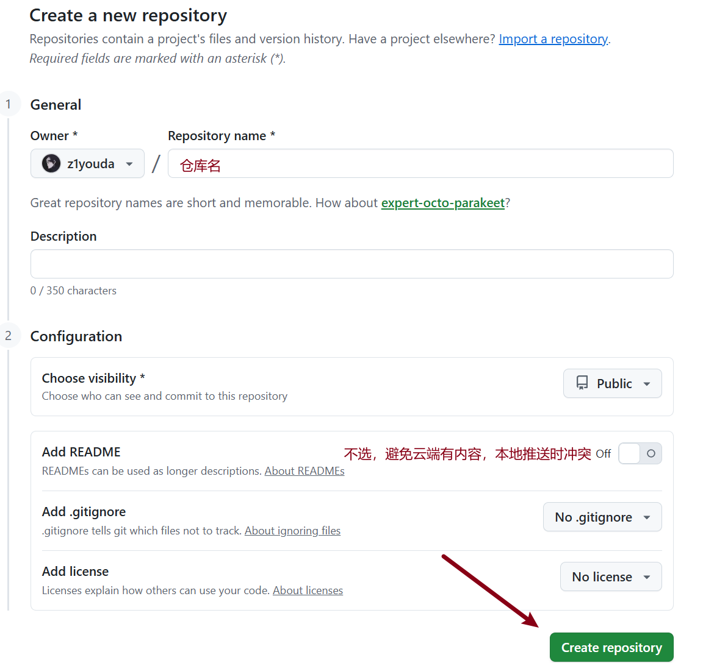
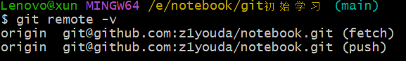

## 一、前期准备

#### 1.安装Git（记得勾选"Git Bash Here"）并配置用户信息

###### 配置Git全局用户信息（与GitHub账号用户名/邮箱一致）

> 打开git bash

* 设置用户名（GitHub账号名)

  `git config --global user.name "你的GitHub用户名"`
* 设置邮箱（GitHub账号绑定的邮箱)

  `git config --global user.email "你的GitHub绑定邮箱@xxx.com" `
* 验证配置

  `git config --list`

  

#### 2.配置SSH密钥（免得每次推送都要输密码）

* 生成SSH密钥（在git bash执行，一直回车即可）

  `ssh-keygen -t ed25519 -C "你的GitHub邮箱@xxx.com"`

  
* 复制SSH公钥（git bash）

  ` cat ~/.ssh/id_ed25519.pub`

  
* 添加公钥到GitHub（登录GitHub，右上角）

  

  

  add ssh key点击之后输入密码即可
* 验证SSH连接（git bash）

  `ssh -T git@github.com`

  

## 二、本地已有仓库（代码）关联新建的GitHub远程仓库

#### 1.在Github新建空远程仓库



#### 2.本地仓库关联远程仓库（在想要上传的文件夹位置，右键打开git bash）

```bash
# 初始化本地仓库（已初始化就跳过）
git init

# 添加远程仓库（origin 是远程仓库的别名，可自定义，默认是origin）
# 替换成新建仓库的SSH地址
git remote add origin git@github.com:你GitHub用户名/仓库名.git

# 验证远程仓库是否添加成功
git remote -v
```



#### 3.本地提交代码

```bash
# 添加所有文件到暂存区
git add .

# 提交到本地仓库（备注要清晰）
git commit -m "初始化仓库，提交本地所有文件"
```

#### 4.推送到GitHub远程仓库

```bash
# 首次推送需指定分支（main是默认分支，旧版git可能是master）
git push -u origin main

# -u
# 把origin main 设置为本地main分支的默认远程分支，后续只需 git push 即可，不用再输完整地址
# 如果推送时提示 fetch first（和你之前遇到的问题一样），说明GitHub远程仓库对仓库内容做出了修改（删除文件等）那就要先执行 
git pull origin main --allow-unrelated-histories 
# 拉取并合并，再重新 
git push
```

## 三、先创建GitHub仓库再克隆到本地（从零开始）

适合本地还没有代码，想先在GitHub创建仓库，再克隆到本地开发

###### 1.在GitHub上新建仓库同上，并复制仓库的SSH地址

###### 2.克隆远程仓库到本地

```bash
# 克隆仓库到本地（替换成你的 SSH 地址）
git clone git@github.com:你的用户名/仓库名.git
# 进入克隆后的本地仓库目录
cd 仓库名

# 此时本地仓库已自动关联远程仓库，可直接修改文件、提交、推送
# 修改文件后，添加到暂存区
git add .
# 提交到本地
git commit -m "修改了xxx文件"
# 推送到远程
git push
```
